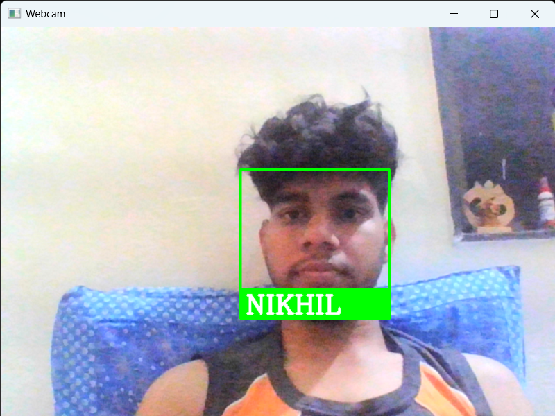

# Gate Security System with Facial Recognition

This project implements a gate security system using facial recognition technology. It authorizes personnel to enter the gate based on stored facial encodings and records their attendance in a MySQL database.

## Installation

1. Clone the repository.
2. Install the required dependencies using `pip install -r requirements.txt`.
3. Set up a MySQL database and configure the connection parameters in the code.

## Usage

1. Run the `main.py` script.
2. Ensure that the webcam is properly set up and faces are clearly visible.
3. Personnel recognized by the system will have their attendance marked automatically.
4. View attendance records in the `Attendance.csv` file.

## Contributing

Contributions are welcome! If you encounter any issues or have suggestions for improvements, please open an issue or submit a pull request.

## License

This project is licensed under the [MIT License](LICENSE).

## Credits

- [face_recognition](https://github.com/ageitgey/face_recognition) library for facial recognition.
- [MySQL Connector/Python](https://dev.mysql.com/doc/connector-python/en/) for MySQL database connectivity.

## Example

